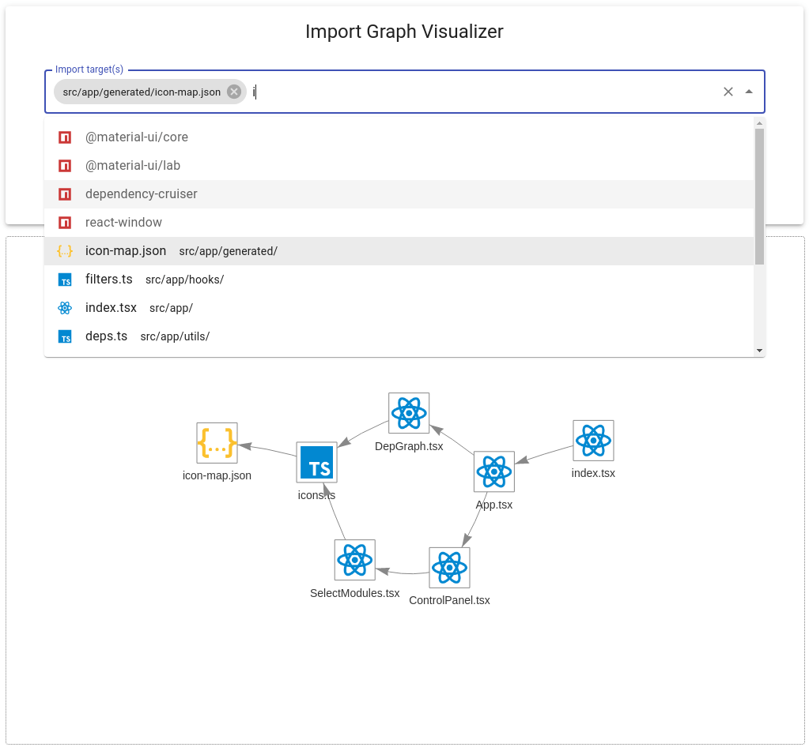
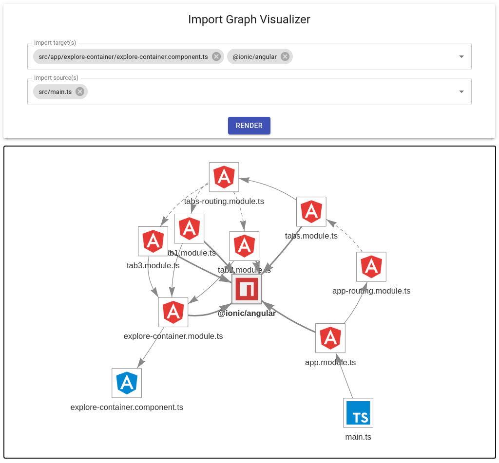
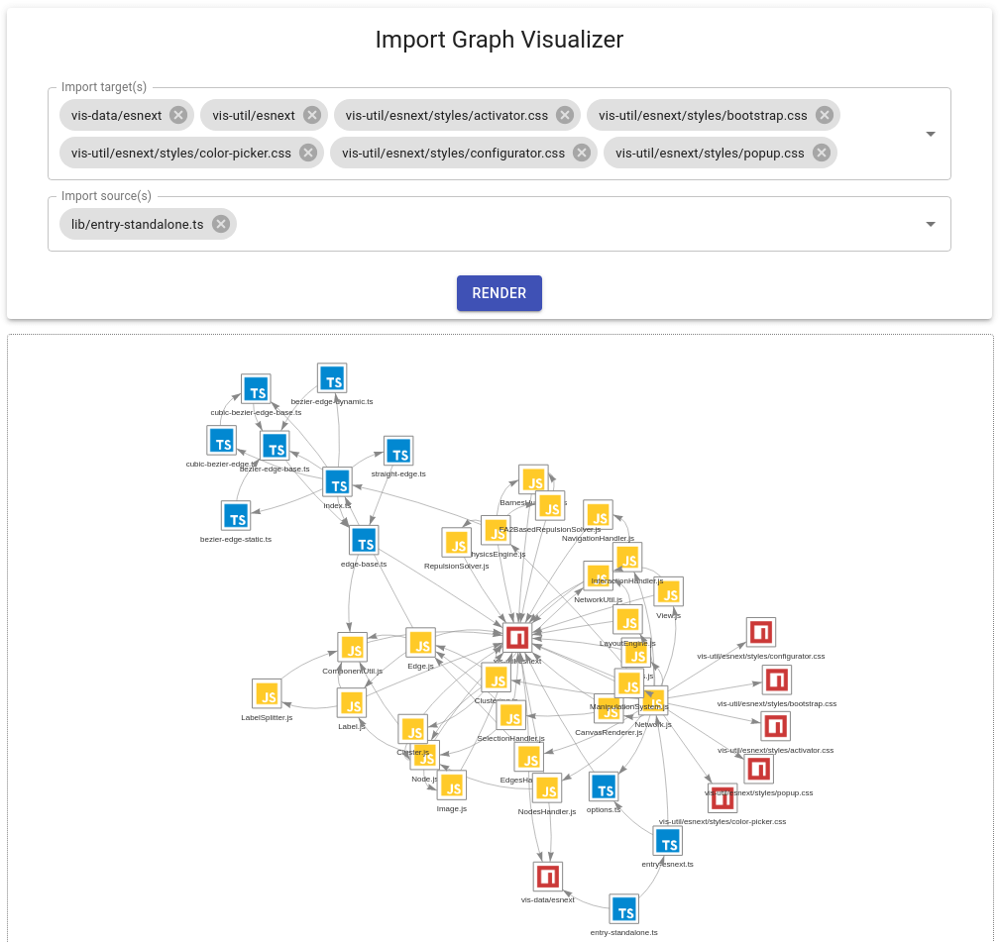

# Import Graph Visualizer

**Import Graph Visualizer is a development tool for filtering and visualizing import paths within a JavaScript/TypeScript application.**

## Motivation

Although there are already excellent tools out there for visualizing imports between Node.js modules (e.g. [Dependency Cruiser](https://github.com/sverweij/dependency-cruiser), which is actually used by this tool under the hood), for large apps these graphs may be too large to comprehend.
This is why Import Graph Visualizer allows filtering import paths by source and target modules, allowing you to zoom in to a limited subsection of your app, which will likely be easier to analyze than the entire app as a whole.

## Examples

Screenshot of Import Graph Visualizer for this repository:



For an Ionic/Angular starter project:



For `vis-network` repo:



## Setup

To install as a development dependency in your Node project:

```sh
npm install --save-dev import-graph-visualizer
```

Alternatively, to install as a global dependency (prefix with `sudo` on Unix systems):

```sh
npm install --global import-graph-visualizer
```

## Usage

To run this tool, you must supply at least one entry point for your application (e.g. `src/index.js`):

```sh
npx import-graph-visualizer --entry-points path/to/entry/module
```

For Typescript projects that use path aliases, make sure to also specify your `tsconfig.json` path:

```sh
npx import-graph-visualizer --entry-points path/to/entry/module --ts-config path/to/tsconfig
```

For greater convenience, you may wish to add a script to your `package.json`:

```json
{
  // ...
  "scripts": {
    // ...
    "import-graph-visualizer": "import-graph-visualizer --entry-points path/to/entry/module ..."
  }
}
```

Then you may run it as:

```sh
npm run import-graph-visualizer
```

## Development

For local development, clone this repo and first install dependencies with:

```sh
npm install
```

Then pick a project for testing and generate its dependencies using the CLI:

```sh
npm run reporter -- --entry-points path/to/entry/module --ts-config path/to/tsconfig/file
```

Then run a development server with:

```sh
npm start
```

If you need to update icons and mappings from [VSCode Material Icon Theme](https://github.com/PKief/vscode-material-icon-theme), run:

```sh
npm run fetch-icons
```
